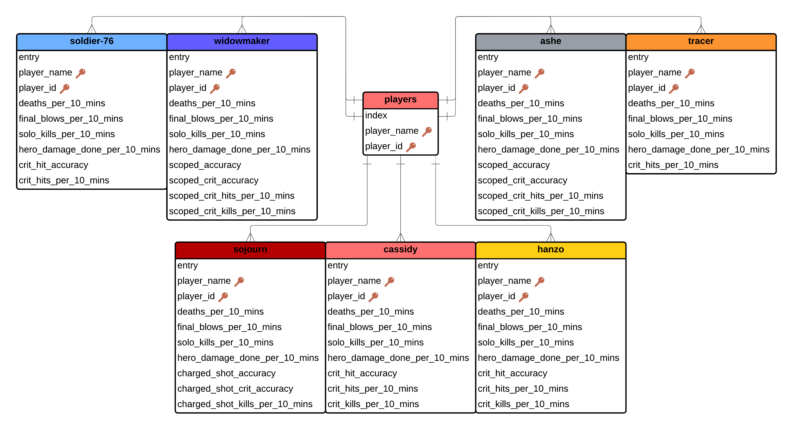
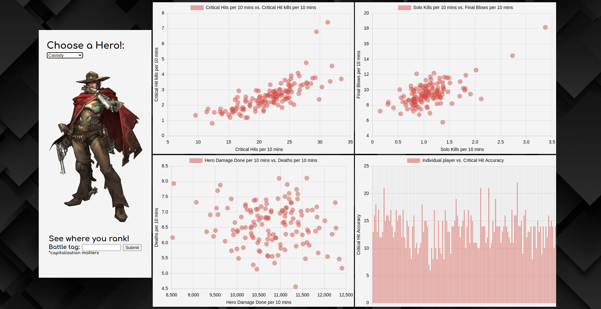
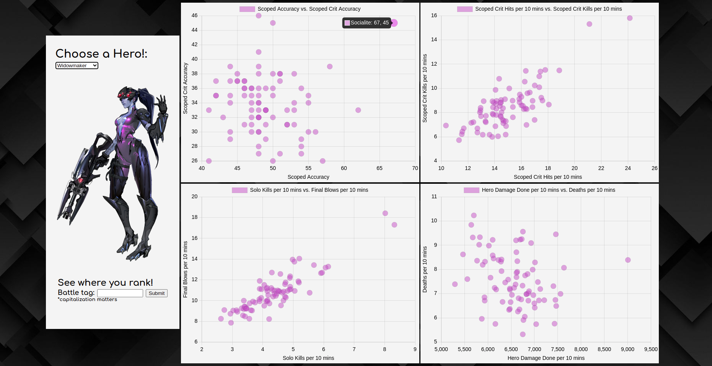
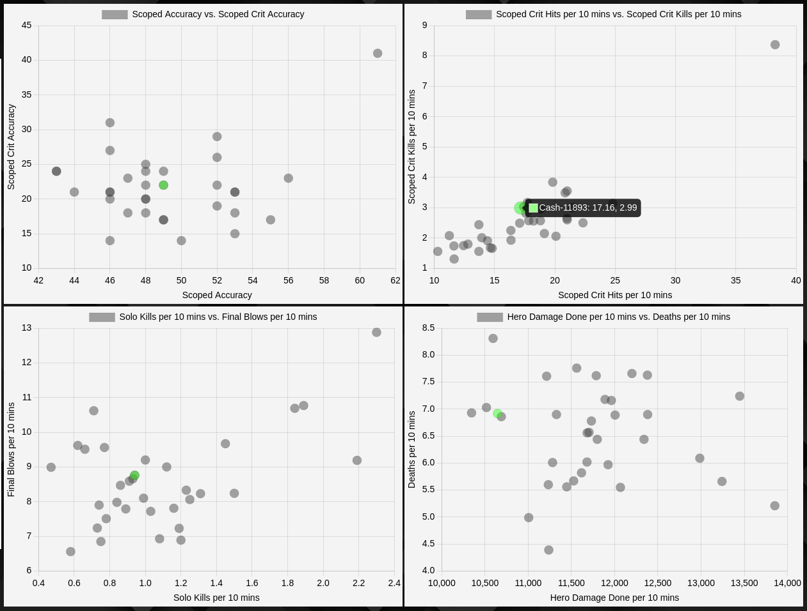

## 📚 Table of Contents

- [🌟 Project Overview](#🌟-project-overview)
- [🔥 Key Features](#🔥-key-features)
- [🛠️ Technologies Used](#🛠️-technologies-used)
- [🔑 Database Structure](#🔑-database-structure)
- [🌱 API Used](#🌱-api-used)
- [📷 Screenshots](#📷-screenshots)

## 🌟 Project Overview

OverGuard was initially a statistical analysis tool designed to attempt to catch cheaters that have abnormally high stats (see [potential cheater](#potential-cheater-👀)) which is the reason behind only featuring hitscan heroes (The most commonly used heroes for players with cheats).
Now OverGuard provides in-depth insights into player performances, focusing particularly on the top 500 players with substantial playtime on selected heroes and associated stats. The application enables users to compare their stats against these top performers, offering an easy way to compare your performance with the best. All players featured in OverGuard are top-500 with atleast 1.5 hours on the selected hero.

## 🔥 Key Features

- **Statistical Comparisons**: Allows users to compare their gameplay stats against top-performing Overwatch players.
- **Focused Analysis**: Supports detailed statistics for seven key heroes: Widowmaker, Ashe, Tracer, Soldier 76, Hanzo, Sojourn, and Cassidy.
- **Interactive Visualizations**: Utilizes Chart.js to display stats in an engaging and easily digestible manner.
- **Fast Data Retrieval**: All data is stored in the associated databases for instant lookup and a smooth experience.
- **Dynamic Content**: Stats are updated automatically at the end of every Overwatch season for the most up-to-date stats.

## 🛠️ Technologies Used

- **C++**: Backend logic and data processing using Crow framework.
- **Crow**: A lightweight C++ web server library used for handling HTTP requests.
- **SQL**: Database management to store and retrieve player statistics.
- **HTML/CSS/JavaScript**: Front-end presentation and interaction.
- **Chart.js**: Visualization library used for rendering interactive charts.

## 🔑 Database Structure

## 🌱 API Used

OverGuard uses the [OverFast API](https://github.com/TeKrop/overfast-api) to get all relevant stats about players.
The application itself will only call to the API when a user wants to compare his/her stats. All data stored in the backend databases was fetched with Overfast.

## 📷 Screenshots

### User Interface

The interface users interact with to compare stats against themselves and other top players

### Potential Cheater 👀

In this screen shot you can see that certain players are "excelling". Widowmaker is the sniper hero in Overwatch and a cheater's best friend. The liklehood this player is using extrenal software is very high when you consider many of the other purple dots are professional players...

### Compare Stats

The green dot is my inputted battle-tag showcasing how easy it is to compare stats with the rest of the players. I have high deaths per 10 but low damage per 10 😔.
